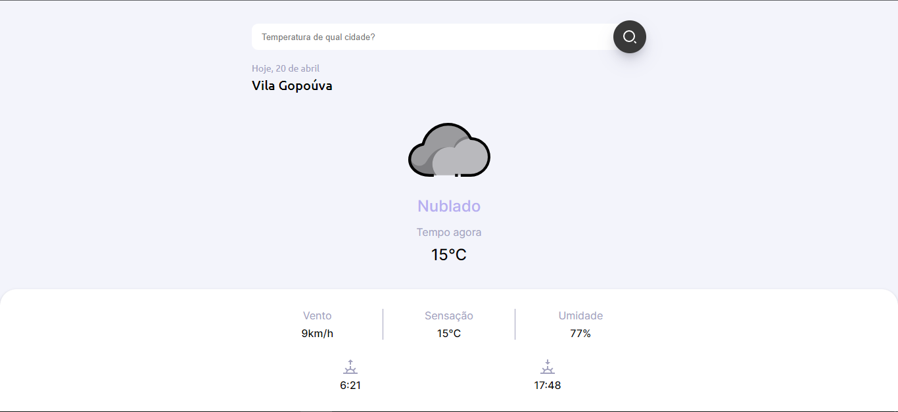

<h1 align="center"> SnapClima </h1>

  

## 🚀 Tecnologias

Esse projeto foi desenvolvido com as seguintes tecnologias:

- HTML e CSS
- JavaScript
- Git e Github

## 💻 Projeto

O SnapClima é uma aplicação de clima com OpenWeather API.

- [Acesse o projeto finalizado, online](https://liceb.github.io/snapclima/)
